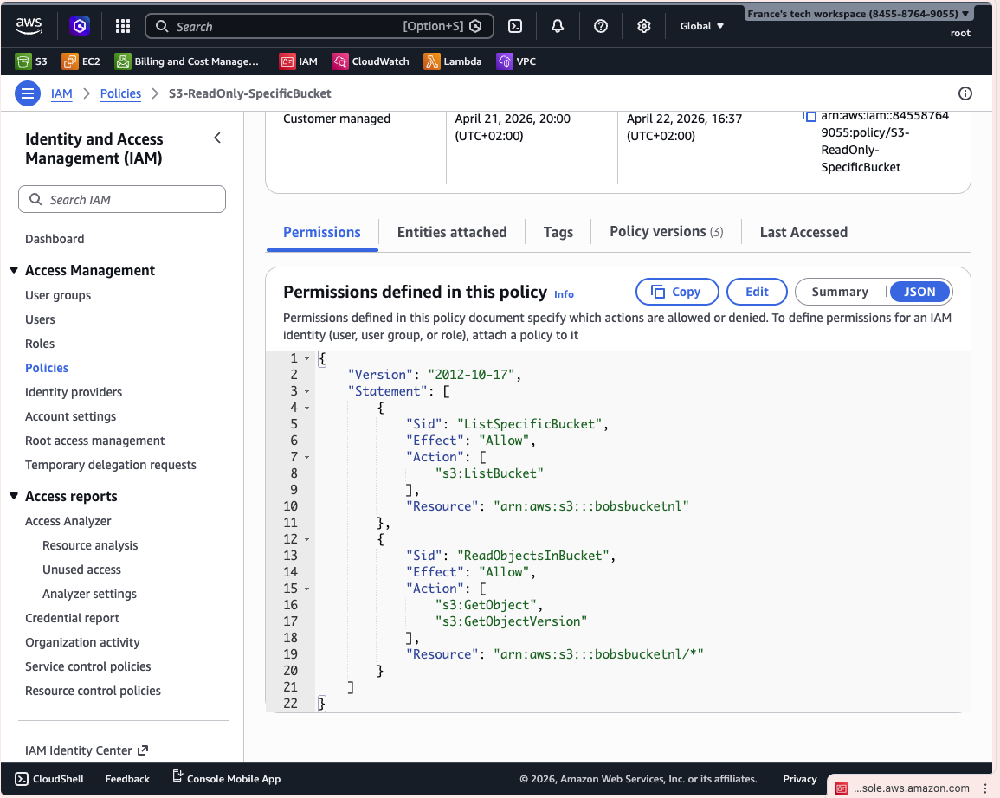
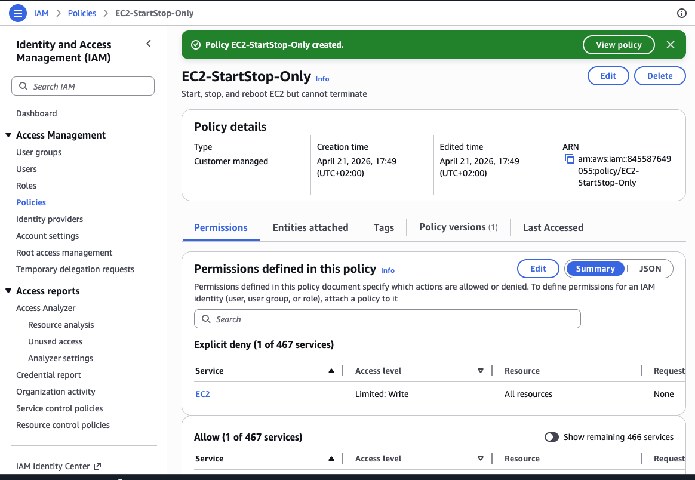
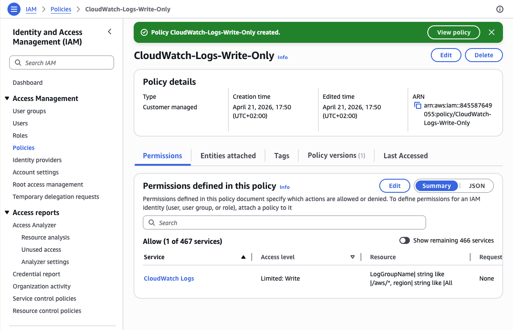
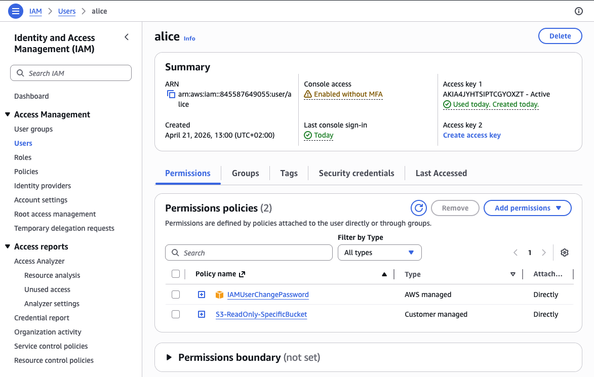
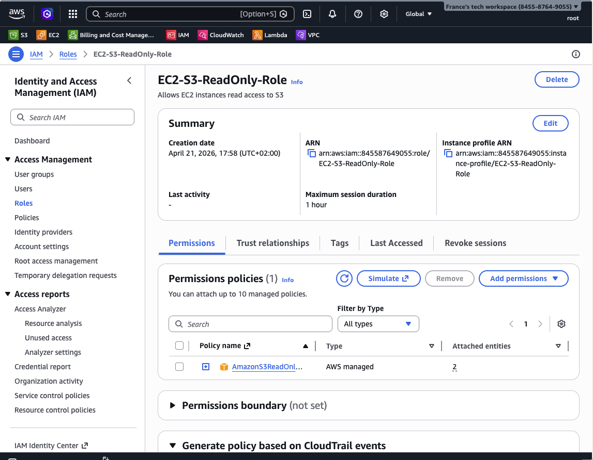
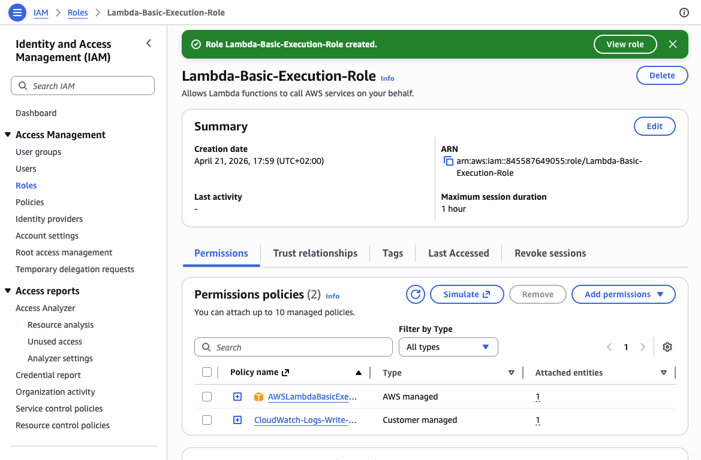
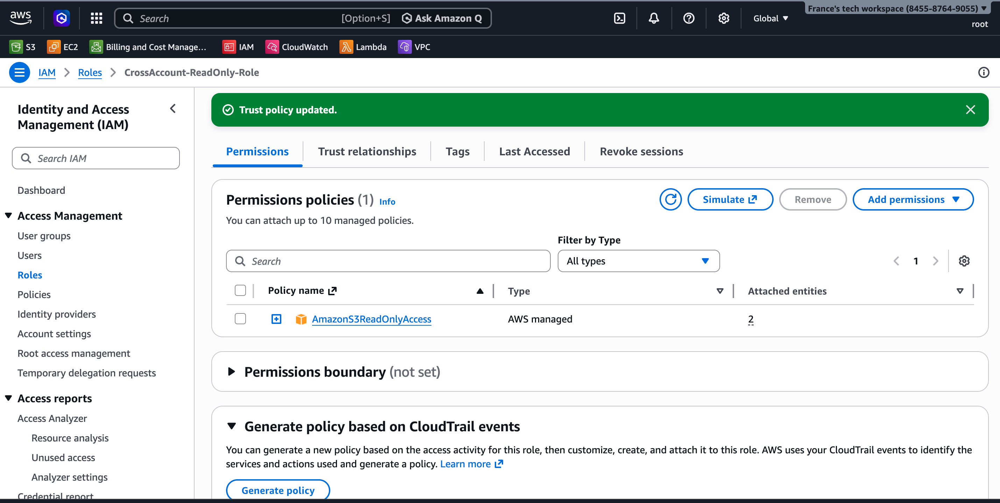
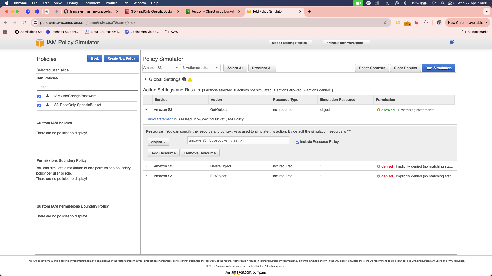

# Lab Solution: IAM Policies and Roles

**Student Name:** France
**Date:** 21 April 2026
**Lab Completion Time:** It took me a couple of hours

---

## Part 1: Understanding IAM Policy Structure

### Task 1: Policy Components Explanation

**Explain each component in your own words:**

**Version:**
```
This is the date of when the policy was last updated. 

**Statement:**
```
It is the main container for the policy logic. Includes multiple individual permissions.
```

**Sid:**
```
This is the main idea of the logic behind the policy. What does it entail? 
```

**Effect:**
```
This is how the policy will be understood if it explicitly grants access or not. 
```

**Action:**
```
This defines what action that needs to be provided access to.
```

**Resource:**
```
This is where it identifies the specific object the policy covers.
```

---

## Part 2: Custom IAM Policies Created

### S3 Read-Only Policy

**Policy Name:** S3-ReadOnly-SpecificBucket

**Bucket Name Used:** bobsbucketnl

**Policy JSON:**
```json
{
	"Version": "2012-10-17",
	"Statement": [
		{
			"Sid": "ListSpecificBucket",
			"Effect": "Allow",
			"Action": [
				"s3:ListBucket"
			],
			"Resource": "arn:aws:s3:::bobsbucketnl"
		},
		{
			"Sid": "ReadObjectsInBucket",
			"Effect": "Allow",
			"Action": [
				"s3:GetObject",
				"s3:GetObjectVersion"
			],
			"Resource": "arn:aws:s3:::bobsbucketnl/*"
		}
	]
}
```

**Screenshot 1: S3 Custom Policy**


---

### EC2 Start/Stop Policy

**Policy Name:** EC2-StartStop-Only

**Policy ARN:** ___________________________

**Screenshot 2: EC2 Custom Policy**


---

### CloudWatch Logs Write Policy

**Policy Name:** CloudWatch-Logs-Write-Only

**Policy ARN:** arn:aws:logs:*:*:log-group:/aws/*

**Screenshot 3: CloudWatch Logs Policy**


---

## Part 3: Policy Attachments

### Policy Attached to User

**User Name:** alice

**Policy Attached:** S3-ReadOnly-SpecificBucket

**Attachment Method:** X Console

**CLI Command (if used):**
```bash
_____________________________________________________________
_____________________________________________________________
```

**Screenshot 4: Policy Attached**


---

## Part 4: IAM Roles Created

### EC2 Service Role

**Role Name:** EC2-S3-ReadOnly-Role

**Role ARN:** arn:aws:iam::aws:policy/AmazonS3ReadOnlyAccess

**Trusted Entity:** ___________________________

**Attached Policies:**
1. AmazonS3ReadOnlyAccess

**Trust Relationship JSON:**
```json
{
    "Version": "2012-10-17",
    "Statement": [
        {
            "Effect": "Allow",
            "Principal": {
                "Service": "ec2.amazonaws.com"
            },
            "Action": "sts:AssumeRole"
        }
    ]
}
```

**Screenshot 5: EC2 Service Role**


---

### Lambda Execution Role

**Role Name:** Lambda-Basic-Execution-Role

**Role ARN:** arn:aws:iam::845587649055:role/Lambda-Basic-Execution-Role

**Attached Policies:**
1. AWSLambdaBasicExecutionRole
2. CloudWatch-Logs-Write-Only

**Screenshot 6: Lambda Role**


---

### Cross-Account Access Role

**Role Name:** CrossAccount-ReadOnly-Role

**Role ARN:** arn:aws:iam::845587649055:role/CrossAccount-ReadOnly-Role

**External Account ID:** 845587649055

**External ID:** unique-external-id-123
**Attached Policies:**
1. ReadOnlyAccess

**Screenshot 7: Cross-Account Role**


---

## Part 5: Policy Testing

### Policy Simulator Results

**Policy Tested:** Yes

**Test Results:**

| Action | Expected Result | Actual Result | Pass/Fail |
|--------|----------------|---------------|-----------|
| s3:GetObject | Allowed | | ☐ Pass ☐ Fail |
| s3:PutObject | Denied | | ☐ Pass ☐ Fail |
| s3:DeleteObject | Denied | | ☐ Pass ☐ Fail |
| ec2:StartInstances | | | ☐ Pass ☐ Fail |
| ec2:TerminateInstances | | | ☐ Pass ☐ Fail |

**Screenshot 8: Policy Simulator**


---

### AWS CLI Testing

**Test 1: S3 List Bucket**
```bash
# Command:
aws s3 ls s3://bobsbucketnl
# Output:
2026-04-21 20:11:24          5 test.txt

# Result: x Success ☐ Access Denied
```

**Test 2: S3 Upload File**
```bash
# Command:
aws s3 cp test.txt s3://bobsbucketnl/ --profile alice
# Output:
upload failed: ./test.txt to s3://bobsbucketnl/test.txt An error occurred (AccessDenied) when calling the PutObject operation: User: arn:aws:iam::845587649055:user/alice is not authorized to perform: s3:PutObject on resource: "arn:aws:s3:::bobsbucketnl/test.txt" because no identity-based policy allows the s3:PutObject action
# Result: ☐ Success X Access Denied (Expected)
```

**Test 3: S3 Download File**
```bash
# Command:
aws s3 cp s3://bobsbucketnl/test.txt ./
# Output:
download: s3://bobsbucketnl/test.txt to ./test.txt  

# Result: x Success ☐ Access Denied
```

---

## Part 6: Least Privilege Implementation

### Custom Policy with Conditions

**Policy Name:** S3-ReadOnly-IPRestricted-bobsbucketnl

**Condition Type Used:** x IP Address ☐ Time Window ☐ MFA ☐ Other: _______

**Policy JSON:**
```json
{
    "Version": "2012-10-17",
    "Statement": [
        {
            "Sid": "ReadOnlyFromMyIP",
            "Effect": "Allow",
            "Action": [
                "s3:ListBucket"
            ],
            "Resource": "arn:aws:s3:::bobsbucketnl",
            "Condition": {
                "IpAddress": {
                    "aws:SourceIp": "145.90.65.82/32"
                }
            }
        },
        {
            "Sid": "GetObjectsFromMyIP",
            "Effect": "Allow",
            "Action": [
                "s3:GetObject"
            ],
            "Resource": "arn:aws:s3:::bobsbucketnl/*",
            "Condition": {
                "IpAddress": {
                    "aws:SourceIp": "145.90.65.82/32"
                }
            }
        }
    ]
}
```

**Rationale for this policy:**
```
Implemented least privilege by restricting S3 access to:
- Specific bucket only
- Read-only actions (ListBucket, GetObject)
- Access limited to my IP address

This ensures the user can only access resources from a trusted network.
```

---

## Part 7: Troubleshooting

### Issue Encountered (if any)

**Issue Description:**
```
I had an issue with testing from step 10. The upload wasnt really failing. 
```

**Commands Used to Diagnose:**
```bash
aws sts get-caller-identity
```

**Resolution:**
```
I checked if the terminal is accepting that I am using the same account ID but im trying to do a test developer profile
```

**Screenshot 9: Troubleshooting Output**


---

## Reflection Questions

### 1. Why are IAM roles preferred over access keys for EC2 instances?

**Your answer:**
```
There are more configurations that a root user can set as per preference and workflow security of the client. 
```

### 2. Explain the principle of least privilege and how you applied it in this lab.

**Your answer:**
```
I've only provided the most minimal access to the users that needs permission to a certain bucket for example. In this lab, I applied it by limiting access for certain actions a user can do to a certain bucket. 
```

### 3. What is the difference between identity-based and resource-based policies?

**Your answer:**
```
Identity based policy controls what they can do and resource-based polocy controls who can access it. 
```

### 4. When would you use an explicit "Deny" in a policy?

**Your answer:**
```
The most important action to apply this would probably for deleting objects or instances. 
```

### 5. Describe a scenario where you'd use conditions in IAM policies.

**Your answer:**
```
IAM could be a good practice to use if a couple of developers from different departments were to work in one project. 
```

---

## Summary of Resources Created

**IAM Policies:**
1. CloudWatch-Logs-Write-Only  (ARN: arn:aws:iam::845587649055:policy/CloudWatch-Logs-Write-Only)
2. S3-ReadOnly-SpecificBucket  (ARN: arn:aws:iam::845587649055:policy/S3-ReadOnly-SpecificBucket)
3. EC2-StartStop-Only  (ARN: arn:aws:iam::845587649055:policy/EC2-StartStop-Only)
4. S3-ReadOnly-IPRestricted-bobsbucketnl (ARN: arn:aws:iam::845587649055:policy/S3-ReadOnly-IPRestricted-bobsbucketnl)

**IAM Roles:**
1. CrossAccount-ReadOnly-Role  (ARN: arn:aws:iam::845587649055:role/CrossAccount-ReadOnly-Role)
2. EC2-S3-ReadOnly-Role  (ARN: arn:aws:iam::845587649055:role/EC2-S3-ReadOnly-Role)
3. Lambda-Basic-Execution-Role  (ARN: arn:aws:iam::845587649055:role/Lambda-Basic-Execution-Role)

**Users Modified:**
1. ___________________________

---

## Cleanup Confirmation

- [ ] Detached all custom policies from users
- [ ] Deleted custom IAM policies
- [ ] Detached policies from roles
- [ ] Deleted test IAM roles
- [ ] Verified no resources remain

**Cleanup Commands:**
```bash
Manually cleaned up via console
```

---

## Self-Assessment

**Rate your understanding (1-5):**

| Concept | Before Lab | After Lab | Improvement |
|---------|-----------|-----------|-------------|
| IAM Policy Structure | 2/5 | 4/5 | +2 |
| Custom Policy Creation | 1/5 | 3/5 | +2 |
| IAM Roles | 4/5 | 5/5 | +1 |
| Service Roles | 3/5 | 4/5 | +1 |
| Trust Relationships | 1/5 | 3/5 | +2 |
| Policy Testing | 1/5 | 4/5 | +3 |
| Least Privilege | 4/5 | 5/5 | +1 |
| Troubleshooting IAM | 1/5 | 4/5 | +3 |

---

## Instructor Verification

**Instructor Name:** ___________________________

**Date Reviewed:** ___________________________

**All policies validated:** ☐ Yes ☐ No

**Roles properly configured:** ☐ Yes ☐ No

**Comments:**
```
_____________________________________________________________
_____________________________________________________________
_____________________________________________________________
```

**Grade/Status:** ___________________________

---

**Lab Status:** ☐ Complete ☐ Needs Revision

**Submission Date:** ___________________________
